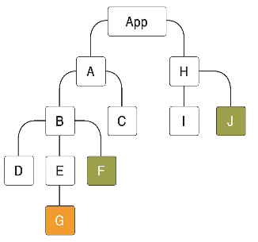

# How to use React Context API

## Context API란

React v16.3 이전에는 전역 상태관리를 하기 위해서는 최상위 컴포넌트인 'App'의 state에 넣어 관리함.

최하단에 존재하는 컴포넌트에 변화로인해 다른 컴포넌트가 변경될 때, state의 변화를 넘기기가 까다로웠음.



그래서 리덕스나 MobX 같은 상태 관리 라이브러리 이용.

이후 버전에서는 Context API가 많이 개선되어 사용할 필요가 없게 됨.

## Context API 사용법

**Context** 만들기

```
import { createContext } from "react";

const ColorContext = createContext({ color: "black" });

export default ColorContext;

```

만들어진 Context를 **Consumer**를 통해 사용하기

```
import React from "react";
import ColorContext from "../contexts/color";

function ColorBox() {
  return (
    <ColorContext.Consumer>
    {value => (
        <div style={{
            width: `64px`,
            height: `64px`,
            background: value.color,
        }}>
        </div>
    )}
    </ColorContext.Consumer>
  );
}

export default ColorBox;

```

createContext로 관리하고 싶은 context를 저장시킴

사용하고 싶은 Component 코드로가서 context를 저장한 변수(ColorContext)를 위 코드와 같이 사용함

위와 같은 패턴을 **Function as a child** 또는 **Render Props**라고 함

저장된 Context의 값을 변경하고 싶을 땐, Provider 사용
**value**를 꼭 명시해 줘야 함!

```
function App() {
  return (
    <ColorContext.Provider value={{ color: "red" }}>
      <>
        <ColorBox></ColorBox>
      </>
    </ColorContext.Provider>
  );
}

export default App;

```

## Dynamic Context

```
function App() {
  return (
    <ColorProvider>
      <div>
        <ColorBox></ColorBox>
      </div>
    </ColorProvider>
  );
}
```

```
import { createContext, useState } from "react";

const ColorContext = createContext({
  state: { color: "black", subcolor: "red" },
  actions: {
    setColor: () => {},
    setSubcolor: () => {},
  },
});

const ColorProvider = ({ children }) => {
  const [color, setColor] = useState("black");
  const [subcolor, setSubcolor] = useState("red");

  const value = {
    state: { color, subcolor },
    actions: { setColor, setSubcolor },
  };

  return (
    <ColorContext.Provider value={value}>{children}</ColorContext.Provider>
  );
};

// const ColorConsumer = ColorContext.Consumer;
const { Consumer: ColorConsumer } = ColorContext;

export { ColorProvider, ColorConsumer };

export default ColorContext;
```

```
import React from "react";
import { ColorConsumer } from "../contexts/color";

function ColorBox() {
  return (
    <ColorConsumer>
      {(value) => (
        <>
          <div
            style={{
              width: `64px`,
              height: `64px`,
              background: value.state.color,
            }}
          ></div>
          <div
            style={{
              width: `32px`,
              height: `32px`,
              background: value.state.subcolor,
            }}
          ></div>
        </>
      )}
    </ColorConsumer>
  );
}

export default ColorBox;
```
